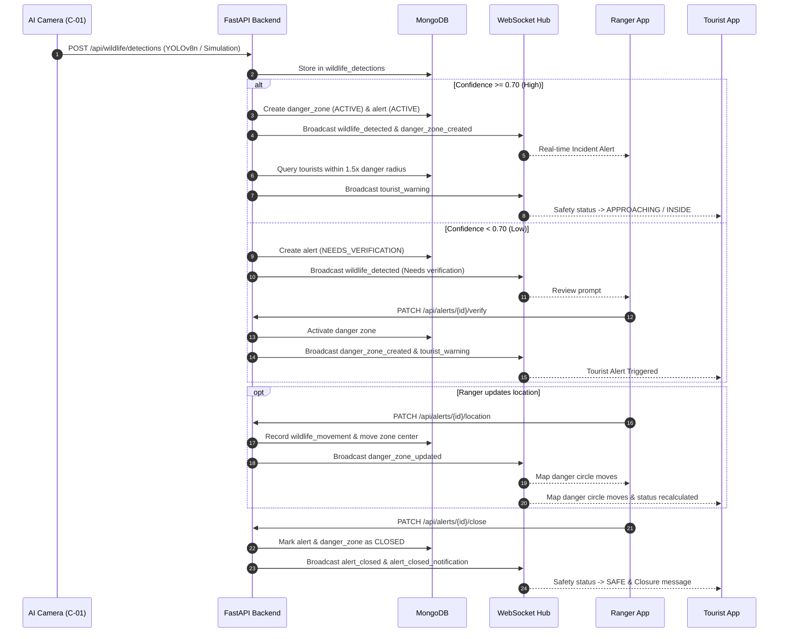

# ForestGuard — System Architecture & Design

ForestGuard is designed as an event-driven, role-segregated safety platform.

## 🔄 End-to-End Incident Flow Diagram

## 🛡️ Security & Privacy Model
1. **RBAC at Gateway & Endpoints:** Endpoints explicitly enforce `require_tourist`, `require_ranger`, or `require_admin`.
2. **Tourist Location Privacy:** Tourists can only retrieve their own location. They never receive or see coordinates of other tourists.
3. **Restricted Incident Visibility:** Rangers can only view tourist coordinates within an active incident zone during an ongoing response.
